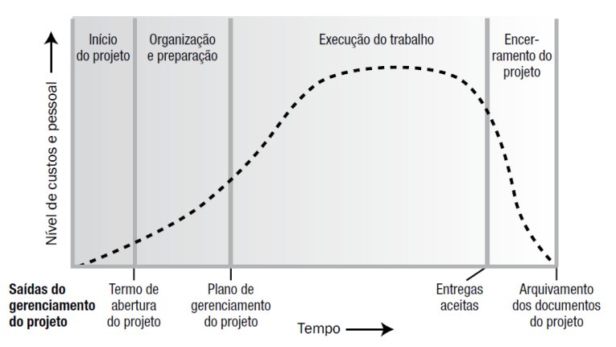
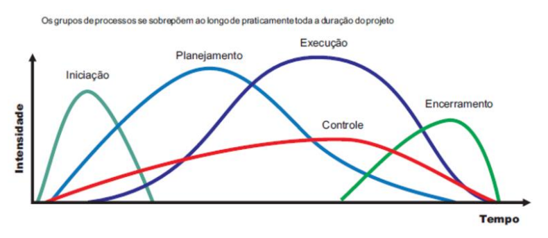
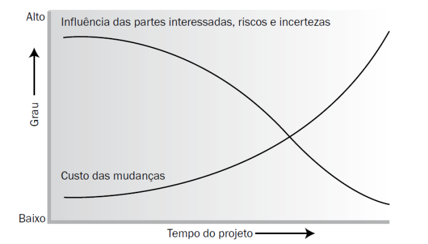
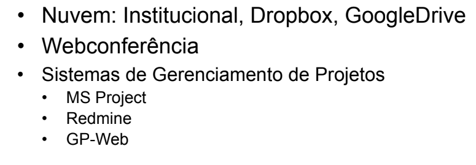

# Introdução a Jogos Digitais

## Aula 01 - 24/02/2025
### Definições
* Contexto: tudo aquilo inerente ao ambiente que o jogo passará, como ambiente, história, som, gráficos, jogabilidade.
* Objetivos: os jogos devem ter alguns objetivos para que seu usuário atinja, como a capacidade de pesquisa, raciocínio, conhecimento, aprendizado, interação, etc.
* Jogos: são programas específicos que possuem:
    - Alta frequência de atualização dos jgos e do display;
    - Interatividade e não linearidade (diferente de filmes e livros);
    - Conceito de "Mundo virtual" (imersão);
    - Executados em consoles, computadores, fliperamas, entre outros;
    - Utilizados para entreter, educar, aprender, treinar e divulgar produtos ou serviços.

### Gameficação
É a prática de uso de jogos para tarefas com pouco apelo estimulate, como o aprendizado de linguas, com o Duolingo.

### Parte acadêmica
Algumas referências acadêmicas (com artigos científicos, etc):
- SBGames: simpósio brasileiro de jogos e entretenimento digital;
- IEEE transactions on games (artigos científicos).

### Desenvolvimento
- Arte e design;
- Interface;
- Música;
- Computação:
    - Algoritmos
    - IA
    - Estruturas de dados
    - Programação paralela
- Matemética e física;
- Marketing e gerenciamento de projetos.

---

## Aula 2 - 10/03/25
### Gestão de Projetos

### O que é um projeto?
- Conjunto de atividades temporárias, realizadas por um grupo, com o objetivo de produzir um produto ou um serviço.

### Projeto x Processos (Operações)

### Ciclo de vida do projeto

### Áreas de conhecimento em gerenciamento de projetos
- Integração
- Escopo
- Tempo
- Custos
- Qualidade
- Recursos humanos
- Comunicações
- Riscos
- Aquisições
- Partes interessadas

### Seleção e avaliação de projetos
Multicritérios:
- Financeiros
- Alinhamento estratégico
- Urgência
- Interessados
- Risco
- Recursos Humanos
- Competência

### TICs em Projetos
