# Aula 1 - 18/02/2025
## História das redes de computadores

A primeira experiência com redes de computadores se deu em 1965 por Lawrence Roberts e Thomas Merril, um em na universidade em Massachusetts e outro na Califórnia.

A internet teve seu início em 1969, para uso militares e em universidades.

Em 1996, 30 mil pessoas tinham acesso a internet no Brasil.

## Comunicação
* Informação: texto, voz, imagem convertida em sinal digital ou analógico.
* Transmissão: smartphone, computador ou tablet que deseja enviar essa informação.
* Canal: meio em que a comunicação passa, pode ser pelo ar, fio de cobre ou fibra ótica.
* Receptor: computador, smartphone ou tablet que receberá a informação.
* Protocolo: conjunto de regras pré-definidas entre o emissor e o receptor.

## Definição de redes

Segundo Tenenbaum:
- Conjunto de módulos e processadores capazes de trocar informações e recursos entre si.
- Não há limite de participantes de uma rede.
- Ativos de rede são equipamentos que necessitam de eletricidade para atuar na rede.*
- Passivos de rede são dispositivos que não necessitam de energia.*

> \* Definição simplificada, não definitiva.

## Tipos de rede
O primeiro tipo de rede é o ponto a ponto (P2P), onde os integrantes da rede compartilham informações e recursos entre si, sem a necessidade da centralização (em um servidor, por exemplo) do dado.

> "O Torrent é um exemplo de comunicação ponto a ponto".

O outro tipo é a rede cliente/servidor, onde os dispositivos (clientes) tem acesso a informação e recursos compartilhados que estão centralizados em um servidor (host).

## Redes determinísticas e não determinísticas

Nas determinísticas, há o controle de tempo para a inserção de informações na rede.

Contrária à primeira, as não determiníticas não possuem controle de tempo, cada host pode enviar suas informações na quantidade que quiser e na hora que quiser.

> É como se a determinística fosse uma partida de volei comum, e a não determinística é uma partida de vôlei com inúmeras bolas sendo utilizadas ao mesmo tempo.

## Topologia de rede

É a disposição física o qual se conecta os nós (componentes da rede) de uma rede mediante a combinação de padrões e protocolos.

### Barramento
Todos os dispositivos recebem a informação que era destinada à um dos dispositivos, dado que estão interligados pelo mesmo cabo. O dispositivo ao qual a informação não é o destino, ignora os pacotes recebidos.
A desvantagem é a lentidão, segurança e fragilidade da rede, dado que o rompimento em qualquer local do cabo, tornará todos os dispositivos offline.

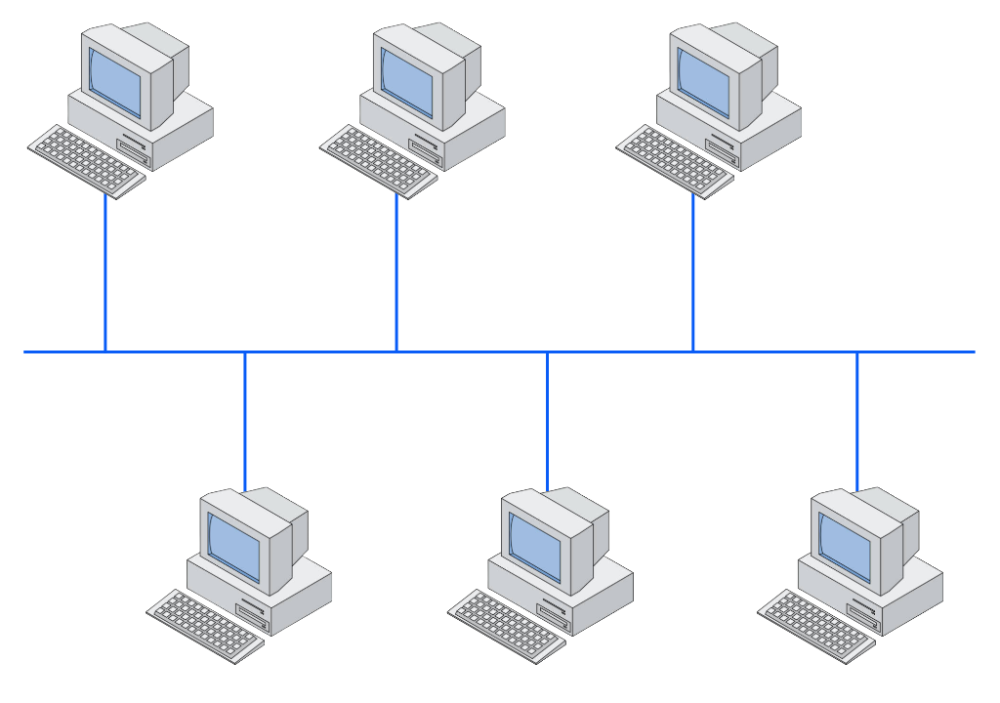

### Estrela
Nesta topologia, os dispositivos da rede são interligados em um nó central.
A vantagem é que os dispositivos são independentes, porém, um problema no nó central pode parar a rede toda.

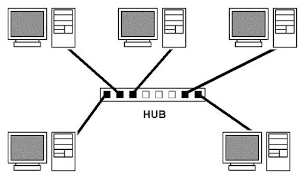

### Anel
Cada dispositivo é interligado com outros dois dispositivos. A vantagem é que um dispositivo será isolado da rede somente se a comunicação com os dois dispositivos falhar.

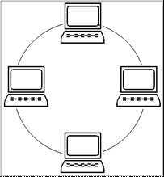

### Estrela estendida
É uma evolução da topologia estrela, com vários nós centralizadores, que por si, são centralizados em outro nó.

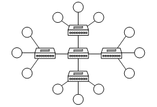

### Topologia completa
Por fim, na topologia completa, todos os nós são interligados entre si.
A comunicação é mais rápida e direta, porém, é uma topologia que apresenta maiores custos de desenvolvimento e manutenção.

### Exemplo prático
Na FHO, os laboratórios possuem a topologia estrela. Entre os laboratórios dos prédios, temos a estrela estendida. Entre os prédios e o servidor central, temos a topologia anel.

## Abrangência de redes
Para a classificação das redes é considerado o tipo de conexão e a amplitude geográfica.
- PAN (Personal Area Network): rede que conecta dispositivos pessoais, como o _smartphone_ e o fone de ouvido.
- LAN (Local Area Network): abrange um prédio ou campus.
- MAN (Metropolitan Area Network): abrange uma cidade.
- WAN (Wide Area Network): abrange o espaço de um país.

A internet é a conexão entre as "ANs", em ordem decrescente de tamanho geográfico.

---

# Aula 2 - 25/02/2025
## Modelo de Referência OSI (ISO 7498)
- É um modelo de referência que dita algumas regras (padrões) a respeito da comunicação entre dispositivos de diferentes tecnologias, hardware e softwares.

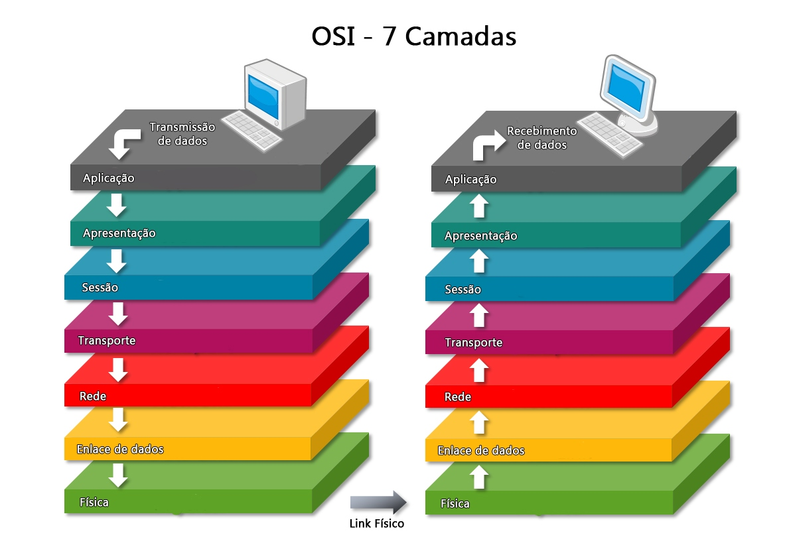
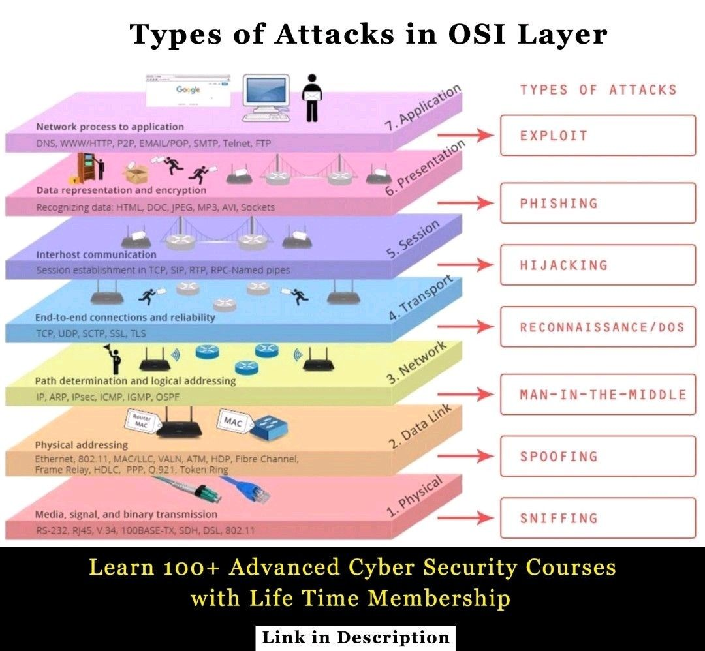

> Das camadas 1 a 3, estamos tratando de hardwares.
> O TCP/IP é uma implementação das camadas OSI.

### Camada Física
> Responsável pela transmissão dos _bits_ através do meio.

> É a camada que faz a leitura dos pulsos no meio de transmissão, como os do cabo de rede.
- Tópicos envolvidos:
    - Topologia (estudada na aula passada);
    - Meios de transmissão (estudada na aula passada);
    - Sentido de transmissão (simples, half-duplex e full-duplex);
    - Sincronismo;
    - Dentre outros.

### Camada de Enlace
- É a camada que lida com o tráfego de quadros (grupo de bits) transmitidos.
> Ela une alguns bits e grupos, chamadas de quadros ou frames.
- Nela, também é determinada as formas de controle de acesso ao meio de transmissão.
- Os dados nesta camada ainda são desfigurados.
- Ela determina, através de um bit de controle, se a comunicação entre o receptor e o emissor está corrompida ou não. Caso o bit de controle não seja recebido por uma das partes, ela solicita o valor novamente ao emissor.
- Tópicos envolvidos:
    - Controle de acesso ao meio: token, CSMA, CSMA/CD, etc.
    - Técnicas de controle de erros: paridade, check sum, CRC, etc.

> Um CRC é um mecanismo de detecção de erro comumente usado em redes de computador e de armazenamento para identificar dados alterados ou corrompidos durante a transmissão. - Cisco.

### Camada de Rede ou Roteamento (Mac)
- Padroniza e define os endereços das máquinas da rede de coputadores.
> Gere o tráfego e rotas da rede. 

### Camada de Transporte
> Transição (conversão) entre o software e o hardware.
- Abstrai a evolução dos hardwares para não afetar as camadas superiores.
- Valida se a informação recebida ou enviada está completa, antes ou após o empacotamento para transmissão.

### Camada de Sessão
> Permite que usuários possam estabelecer sessões entre as máquinas da rede. 
- Nela, também é tratada a etapa de sincroninismo da comunicação, caso tenha havido alguma oscilação no processo.
> Gerenciamento de atividades (transações). 

### Camada de Apresentação
- E uma camada de tradução dos dados, chamada de codificação, para o uso da próxima camada.
- Realiza uma criptografia básica do dado. 
> Compacta os dados. 

### Camada da Aplicação
> Esta camada oferece o acesso as aplicações que estão sendo executadas nos computadores ligados na rede.

---

    

# Aula 3 - 11/03/2025
## Modelo de TCP/IP

O modelo TCP/IP possui quatro camadas: Camada de Aplicação, Camada de Transporte, Camada de Rede, Camada de Enlace e a Camada de Física (normalmente não conta).

Cada camada possui um conjunto de protocolos que permitem a transmissão de dados e a comutação de pacotes entre diferentes nós em uma rede.

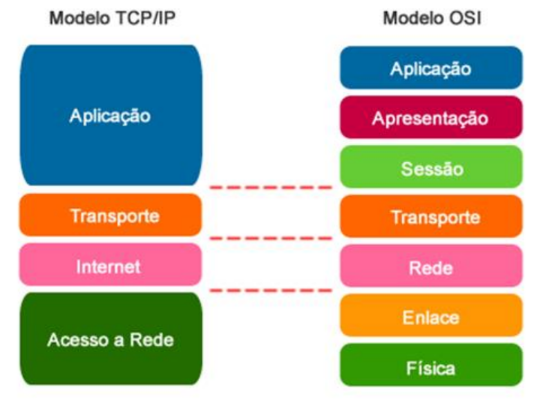

> O modelo TCP/IP implementa o modelo OSI, onde o modelo prático é o próprio TCP/IP, e o modelo teórico é o OSI.

**Camada Aplicação**

Nesta camada estão as aplicações que serão utilizadas pelo usuário para realizar a comunicação.

Fazem o uso das camadas para realizar a comunicação com as redes.

- Protocolos: DHCP, HTTP, HTTPS, DNS, FTP, IMAP...

**Camada de Transporte**

É a camada responsável pela transferência de dados entre duas máquinas, independente da aplicação usada e do tipo. Ela reúne protocolos de transporte end-to-end entre máquinas, isto é, uma entidade (software/hardware).

- Usa protocolos TCP ou UDP
    - TCP (Transmission Control Protocol) é uma rede orientada a conexão
    - UDP (User Datagram Protocol) não é uma rede orientada a conexão

> **TCP** faz o controle de fluxo a fim de evitar congestionamento no fluxo da comunicação. Usamos ele quando precisamos garantir que a informação chegue completa no seu destino.

> **UDP** é um protocolo não confiável, pois ele nao controla o fluxo, não daz o reenvio de segmentos que falharam na transmissão, também não realiza a ordenação de pacotes que chegaram ao destino desordenados e não retorna a confirmação de que os dados foram entregues ao destino. Um exemplo é as ligações em vídeo pelo Whatsapp e ou pelo Skype, onde há a alteração dos pixels de transmissão (imagem não fica muito boa), a voz muitas vezes não se encaixa com o vídeo, há uns engasgos...

**Camada de Internet (Inter-redes)**

Responsável pela permissão de envio de pacotes por hosts a qualquer rede e pela garantia de que esses dados cheguem ao seu destino final. Ela possui embasamento nos protocolos IP (Internet Protocol) e ICMP (Internet Control Message Protocol), que são operalizados na camada de rede do Modelo OSI também.

> utilizando o comando 'ping' no cmd ou no Git Bash e logo após consultar um site, ele utiliza o protocolo ICMP para consultar os pacotes enviados para o site e mostrar se teve perdas ou não.

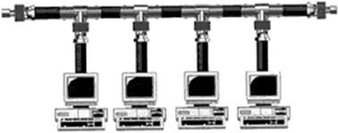

- **Protocolo IP** é um protocolo de comunicação usado entre todas as máquinas de uma rede para encaminhamento dos dados. 

- O **IPv4** é composto por uma sequência de 8 bits com formato x.x.x.x, em que X pode ir de 0 à 255.3

- Link de video sobre Protocolo IP: https://www.youtube.com/watch?v=HNQD0qJ0TC4

**Camada de Enlace de Dados**

A camada de enlace do modelo OSI é responsável por garantir a transferência confiável de dados entre sistemas. Ela funciona como um fiscal, verificando se os pacotes de dados estão corretos e controlando o fluxo de transmissão.

- Protocolos usados: PPP (point-to-point), NDP, ARP, MAC...

---

    

# Aula 4 - 18/03/2025
## Camada Física(1) - Meios de Transmissão
A camada física é a camada mais baixa do modelo OSI e é responsável por definir os meios de transmissão de dados. Os meios de transmissão podem ser guiados ou não guiados. 

**Meios de transmissão guiados:**
- Cabo coaxial: feito de um fio de cobre rígido
- Par trançado: composto por quatro pares de fios de cobre trançados entre si
- Fibra óptica: filamento fino e flexível, feito de sílica.

### Cabo par trançado
Os cabos UTP e STP são cabos de par trançado, utilizados para transmitir informações. A principal diferença entre os dois é que os cabos STP são blindados, enquanto os UTP não são.

**Características dos cabos UTP:**
- São usados para taxas de dados cada vez mais altas 
- São comparativamente simples na sua conceção e correspondentemente finos e flexíveis 
- A frequência de transmissão especificada é de 100 MHz

**Características dos cabos STP:**
- São usados em ambientes externos, onde os cabos são expostos aos elementos 
- São usados em ambientes com alta interferência, como instalações industriais 
- Podem melhorar bastante a taxa de sinalização em um dado esquema de transmissão 

**Cabos UTPs:**
O cabo CAT6 é superior ao CAT5e em termos de velocidade de transmissão e largura de banda. O CAT6 é indicado para redes domésticas que precisam de grandes volumes de dados.

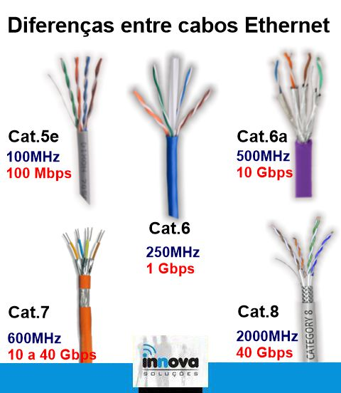

> O CAT5e oferece desempenho significativamente superior sobre o velho padrão CAT5, incluindo velocidades mais rápidas em até 10 vezes e uma habilidade infinitamente superior de atravessar distâncias sem ser impactado por diafonia.

> O cabo de rede não pode ultrapassar de 100m, pois prejudica a velocidade de transmissão de dados, podendo não entregar sua máxima velocidade. Sendo assim, o interessante é trabalhar com no máximo 90m de distância.

**Conectores LC e SC:**
Qual é a diferença entre os conectores LC e SC?
Esta é uma das diferenças básicas entre esses dois conectores. O conector SC possui uma ponteira de 2,5 mm, enquanto o LC possui uma ponteira de 1,25 mm, que tem exatamente a metade do tamanho do SC.

**Cabos de Fibra Óptica:**
Fibra óptica é um filamento transparente que transmite dados por meio de pulsos de luz. É feita de vidro ou plástico e é utilizada em telecomunicações, redes de alta velocidade e monitoramento.
As fibras ópticas são feitas de fibra de vidro e são usadas para transportar dados a longas distâncias através de sinais luminosos.

- **Fibra ótica monomodo (SM)** e **multimodo (MM)** são dois tipos de fibras ópticas que se diferenciam pelo diâmetro do núcleo e pela forma como a luz se propaga.
> A fibra monomodo (SM) é mais indicada para projetos com cabeamentos mais distantes, pois tem menor dispersão da luz e maior qualidade de sinal. A fibra multimodo (MM) é mais comum para redes internas, pois é mais fácil de instalar e manter.

### Normas dos cabos e conectores
A **TIA 568A** é uma norma que define a ordem dos fios em um conector RJ-45. Ela é utilizada em redes de computadores e está relacionada à telecomunicações.

A norma **TIA 568B** é um padrão técnico que define como devem ser os cabos de telecomunicações em edifícios comerciais. Ela também especifica a ordem dos fios dentro do conector RJ-45.

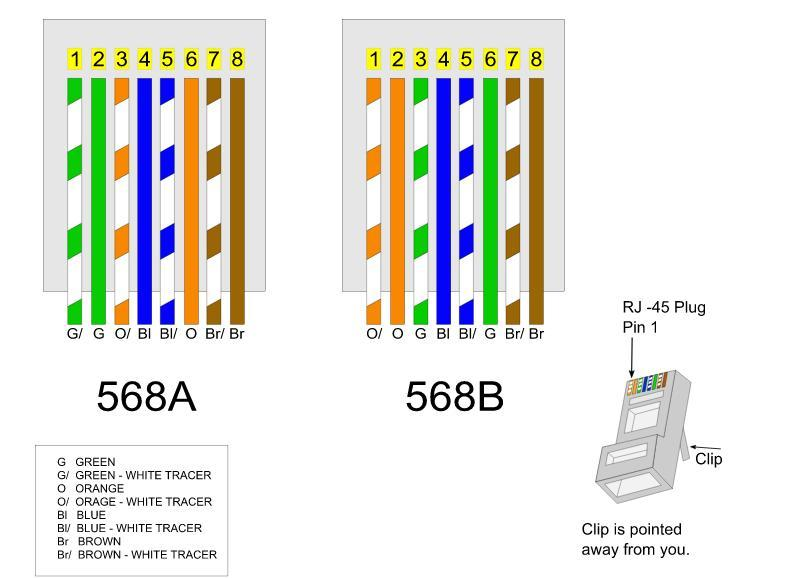

### Painéis
**Voice Panel:**
O Voice Panel é um painel de distribuição para sistemas de comunicação por voz utilizado nas salas de Telecomunicações para facilitar o espelhamento de blocos de conexão 110IDC. Em apenas 1U de Rack possibilita o espelhamento de até 50 portas para utilização de serviços de voz.

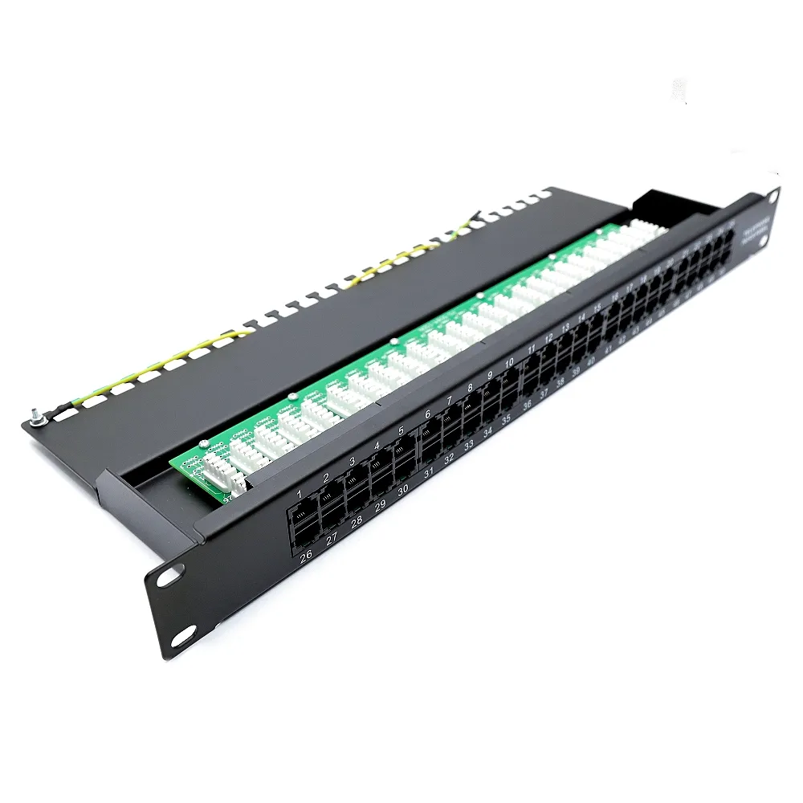

### Ativos e Passivos de Rede
Ativos e passivos de rede são equipamentos que permitem a transferência de dados e sinais em uma rede de computadores. A diferença entre eles é que os ativos processam as informações, enquanto os passivos apenas as transportam. 

**Ativos de rede**
- São dispositivos inteligentes que analisam e decodificam dados 
- São responsáveis por processar, rotear e controlar o fluxo de dados 
- São capazes de gerar e receber dados, além de converter sinais eletrônicos ou ópticos 
- São responsáveis pela comunicação entre computadores e servidores 
- Exemplos: roteadores, hubs, switches, servidores, placas de rede, firewall 

**Passivos de rede**
- Transportam os dados, mas não interferem nas informações trafegadas 
- Possibilitam a ligação entre as diversas partes de uma infraestrutura de rede 
- Exemplos: conectores Rj45, tubo de polietileno, fontes de alimentação, réguas de alimentação e de distribuição, bastidores de rede, patch panels, calhas 

**Patch Panel:**
Um patch panel é um painel de hardware que permite conectar e gerenciar cabos de rede. É um componente fundamental em redes locais (LAN) e é comumente usado em data centers, salas de servidores e armários de telecomunicações. 

**Principais características:** 
- Organiza e gerencia cabos de rede
- Permite conectividade flexível
- É um ponto central para conectar vários dispositivos de TI
- É um intermediário entre a infraestrutura de cabeamento e o equipamento de rede
- Permite a interconexão entre dispositivos de rede, como switches, roteadores e servidores

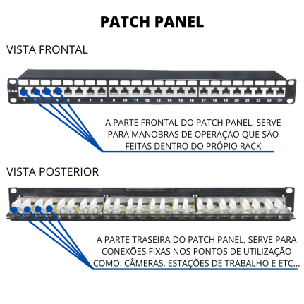

## Camada de Rede(3) - Dispositivos
A camada 3 do modelo OSI usa protocolos como IP, IPsec, ICMP e NAT. A camada 3 é a camada de rede, que é responsável por rotear pacotes de dados entre redes.

### Switch
Um switch de rede, ou comutador, é um dispositivo que conecta vários dispositivos em uma rede. Ele permite que os dispositivos compartilhem informações e se comuniquem entre si. 

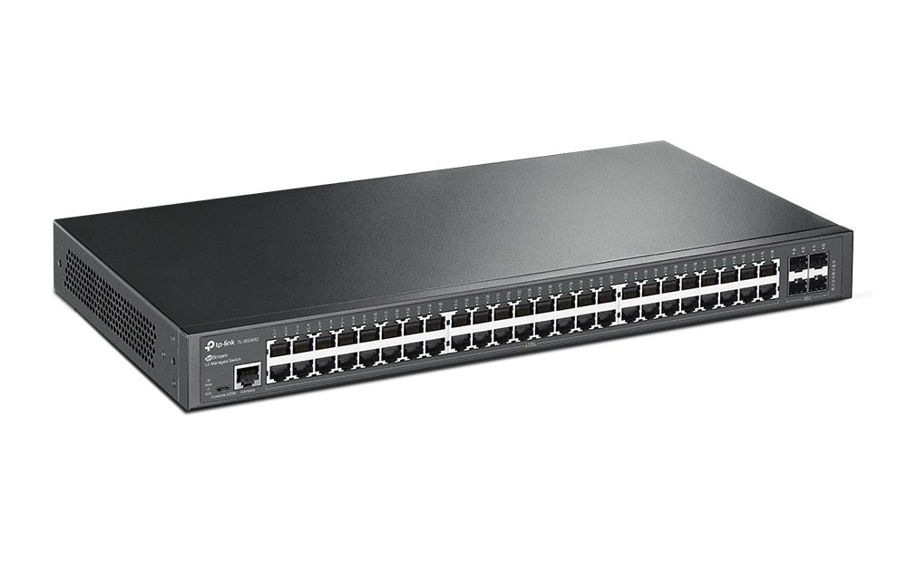

**Como funciona:**
- Os switches encaminham pacotes de dados de um dispositivo a outro 
- Os switches podem operar na camada de enlace (OSI 2) ou na camada de rede (OSI 3) 
- Os switches L2 utilizam o endereço MAC para enviar a informação

### Modos de Transmissão de Dados
Modos de Transmissão de Dados referente ao sentido: Simplex, Half-Duplex e Full-Duplex

**Simplex**

É o modo de transmissão em sentido único ou uniderecional, caracteriza-se em uma ligação na qual os dados circulam num só um sentido, ou seja do emissor para o receptor.

Exemplos: Rádio, TV.

**Half-Duplex**

É o modo de transmissão em sentido duplo em função do tempo, não simultâneo. Assim, com este tipo de ligação, cada extremidade da ligação emite por sua vez.

Exemplos: Walkie-talkies, Redes de computadores, Sistemas de telecomunicações, Redes Wi-Fi.

**Full-Duplex**

É o modo de transmissão em sentido duplo ou bidirecional simultâneo. Assim, cada extremidade da linha pode emitir e receber ao mesmo tempo, o que significa que a banda concorrida está dividida por dois para cada sentido de emissão dos dados.

Exemplo: Celular.

> As taxas de Tx (emissor/transmissor) e RX (receptor) referem-se a taxas de transmissão ou recepção de dados. Os dados TX referem-se à quantidade de dados transmitidos e os dados RX referem-se à quantidade de dados recebidos.

---

    

# Aula 5 - 25/03/2025
## Protocolos das camadas do modelo TCP/IP

### A Camada de Internet/Rede (Modelo TCP/IP - Camada 2)

### Rede Wi-fi 802.11
O padrão 802.11 é uma família de especificações que define a tecnologia Wi-Fi, ou seja, redes locais sem fio (WLAN). O 802.11 foi o primeiro padrão de rede sem fio a ser amplamente adotado. 

> 802.11a, 802.11b, 802.11g e 802.11n são padrões de Wi-Fi definidos pelo IEEE (Institute of Electrical and Electronics Engineers). Eles definem como os dispositivos se conectam e se comunicam sem fio, com a trasmissão de dados de no máximo 2,4GHz.

> 802.11ac opera com a frequência de 5GHz.

### Protocolo de roteamento 

Os protocolos de roteamento são regras que definem como os roteadores encaminham pacotes de dados por uma rede. Eles podem ser **internos** ou **externos**, dependendo do tipo de rede que utilizam. 

**Protocolos de roteamento internos**
- OSPF: Identifica as rotas mais curtas e rápidas para enviar pacotes. É um protocolo de estado de enlace. 
- ISIS: Um protocolo de estado de enlace. 
- IGRP: Um protocolo de vetor de distância. 

**Protocolos de roteamento externos**
- BGP: Anuncia quais redes controlam quais endereços de IP e quais redes se conectam entre si. É um protocolo de roteamento dinâmico.

**Protocolos de roteamento autônomos**

Os protocolos de roteamento autônomos são usados para trocar informações entre os sistemas autônomos (AS) de uma rede. Os AS são redes menores que podem ser provedores de internet, universidades ou redes corporativas.
 
> **BGP - Border Gateway Protocol:**
Anuncia quais redes controlam quais endereços IP e quais redes se conectam entre si. 

> **EGP - Exterior Gateway Protocol:**
É um protocolo de roteamento que permite a comunicação entre diferentes sistemas autônomos. É usado para que todos os sistemas autônomos da internet mantenham informações atualizadas. 

## Camada de Aplicação (Modelo TCP/IP - Camada 4)

### Protocolos
- **DHCP:** ele é responsável pela configuração dinâmica do endereço IP. Ou seja, por meio desse protocolo, e do serviço de DHCP é possível a configuração automática e a disseminação de endereços IPs em toda a rede.
> DHCP utiliza protocolo UDP na camada de transporte, onde a porta de comunicação utilizada é a 67

- **DNS:** é o protocolo de resolução de nomes de domínio. O protocolo responsável por resolver todos os nomes de domínio existentes na internet ou na rede interna. A partir dele podemos saber qual o endereço IP do site que estamos tentando acessar.
> DNS utiliza protocolo UDP na camada de transporte, onde a porta de comunicação utilizada é a 53

- **FTP/SFTP:** é muito utilizado na transferência de arquivos (seguro). Utiliza para a publicação de arquivos de qualquer tipo na rede, e dessa forma qualquer host com acesso pode fazer o download do arquivo em sua íntegra. 
> FTP/SFTP utiliza protocolo TCP na camada de transporte, onde a porta de comunicação utilizada é a 21

- **SSH:** é utilizado para acesso remoto controlado em ambiente shell (prompt de comando) muito utilizado por desenvolvedores ou analistas de redes para acessos remotos em servidores Linux.
> SSH utiliza protocolo TCP na camada de transporte, onde a porta de comunicação utilizada é a 22

- **RDP:** é o protocolo de acesso remoto para ambiente Windows, exatamente mesma funcionalidade do SSH, porém para ambiente Windows
> RDP utiliza protocolo TCP na camada de transporte, onde a porta de comunicação utilizada é a 3389

- **SNMP:** é utilizado para monitorar e gerenciar as redes, protocolo simples e muito leve, não causa danos ou trafégos excessivos na rede, e consegue trazer vários metadados de equipamentos conectados a rede para sua gestão e monitoramonto remoto.
> SNMP utiliza protocolo UDP na camada de transporte, onde a porta de comunicação utilizada é a 161

- **IMAP:** é o protocolo de recebimento de mensagens de email. Ele permite que vo^ce acesse de qualquer lugar sua caixa de correio eletrônico.
> IMAP utiliza protocolo TCP na camada de transporte, onde a porta de comunicação utilizada é a 143 ou 993

- **POP3:** tem a mesma funcionalidade do protocolo IMAP, porém ao invés de permitir acesso ao email, ele faz o download das mensagens.
> POP3 utiliza protocolo TCP na camada de transporte, onde a porta de comunicação utilizada é a 110

- **SMTP:** é o protocolo de envio de mensagens de email.
> SMTP utiliza protocolo TCP na camada de transporte, onde a porta de comunicação utilizada é a 587.

- **HTTP:** é o protocolo utilizado para transferência de hipertexto e hipermídia, sendo a base para as páginas web que temos acesso hoje, sites, etc.
> HTPP utiliza protocolo TCP na camada de transporte, onde a porta de comunicação utilizada é a 80 ou 8080

- **HTTPS:** é a evolução do HTTP, adicionando uma camada robusta de criptografia dos dados e autenticação de certificado digital.
> HTTPS utiliza protocolo TCP na camada de transporte, onde a porta de comunicação utilizada é a 443

- **NTP:** é o protocolo utilizado para sincronização de data e hora dos equipamentos de rede. Muito utilizado para sincronização, e manter os registros de logos de acesso com data e hora padrão, para facilitar a verificação e auditoria.
> NTP utiliza protocolo UDP na camada de transporte, onde a porta de comunicação utilizada é a 123

## A Camada de Internet/Rede (Modelo TCP/IP - Camada 2) 

### Protocolos
- **ICMP:** é o protocolo integrado de controle do protocolo IP, destinado a envio e recebimento de mensagens de controle. É o protocolo utilizado para retorno de mensagens de erro do protocolo IP.

- **RIP:** é um protocolo de roteamento, baseado no algoritmo Vetor-distância. É utilizado para configuração de rotas de roteamento estáticos entre roteadores de borda de operadoras.

- **OSPF:** é um protocolo de roteamento dinâmico, também destinado a configuração de rotas estáticas entre roteadores, porém baseado sempre no caminho mais curto até o destino. Muito utilizado em redes de redundância, e topologia em anel.

## A Camada de Enlace (Modelo TCP/IP - Camada 2) 

### Protocolos
- **Ethernet:** protocolo de conexão que garante como os hardwares se comunicam através do meio físico.

- **ARP:** é o protocolo de resolução de endereços IP, através dele é gerada a tabela ARP, onde contém os endereços IP e endereços MACadress dos equipamentos conectados na rede.

- **PPP:** é usado para estabelecer conexões entre dois roteadores diretamente, sem nenhum host ou outra rede no meio.

---
 
    

# Aula 6 - 01/04/2025
## Multplexação de Sinais
A multiplexação de sinais em redes é uma técnica que combina vários sinais digitais ou analógicos em um único sinal composto. O objetivo é compartilhar um recurso escasso, como um meio de transmissão física. 

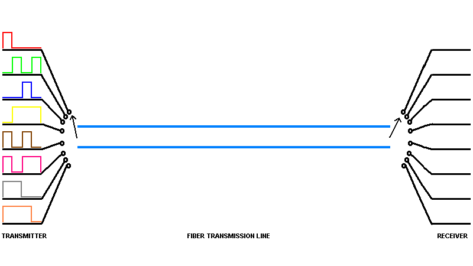

A multiplexação é utilizada em redes de computadores e telecomunicações. 