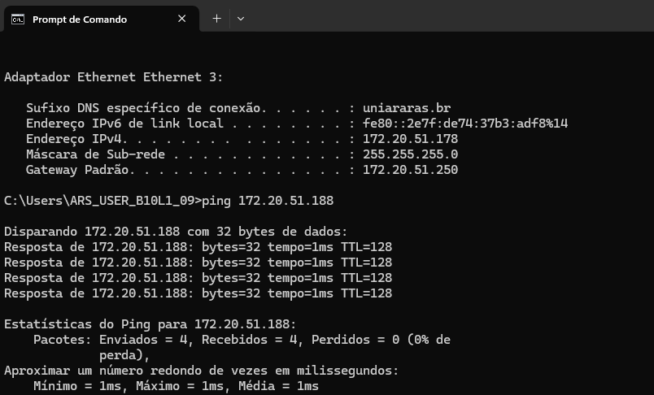

# Aula 1 - 18/02/2025
## História das redes de computadores

A primeira experiência com redes de computadores se deu em 1965 por Lawrence Roberts e Thomas Merril, um em na universidade em Massachusetts e outro na Califórnia.

A internet teve seu início em 1969, para uso militares e em universidades.

Em 1996, 30 mil pessoas tinham acesso a internet no Brasil.

## Comunicação
* Informação: texto, voz, imagem convertida em sinal digital ou analógico.
* Transmissão: smartphone, computador ou tablet que deseja enviar essa informação.
* Canal: meio em que a comunicação passa, pode ser pelo ar, fio de cobre ou fibra ótica.
* Receptor: computador, smartphone ou tablet que receberá a informação.
* Protocolo: conjunto de regras pré-definidas entre o emissor e o receptor.

## Definição de redes

Segundo Tenenbaum:
- Conjunto de módulos e processadores capazes de trocar informações e recursos entre si.
- Não há limite de participantes de uma rede.
- Ativos de rede são equipamentos que necessitam de eletricidade para atuar na rede.*
- Passivos de rede são dispositivos que não necessitam de energia.*

> \* Definição simplificada, não definitiva.

## Tipos de rede
O primeiro tipo de rede é o ponto a ponto (P2P), onde os integrantes da rede compartilham informações e recursos entre si, sem a necessidade da centralização (em um servidor, por exemplo) do dado.

> "O Torrent é um exemplo de comunicação ponto a ponto".

O outro tipo é a rede cliente/servidor, onde os dispositivos (clientes) tem acesso a informação e recursos compartilhados que estão centralizados em um servidor (host).

## Redes determinísticas e não determinísticas

Nas determinísticas, há o controle de tempo para a inserção de informações na rede.

Contrária à primeira, as não determiníticas não possuem controle de tempo, cada host pode enviar suas informações na quantidade que quiser e na hora que quiser.

> É como se a determinística fosse uma partida de volei comum, e a não determinística é uma partida de vôlei com inúmeras bolas sendo utilizadas ao mesmo tempo.

## Topologia de rede

É a disposição física o qual se conecta os nós (componentes da rede) de uma rede mediante a combinação de padrões e protocolos.

### Barramento
Todos os dispositivos recebem a informação que era destinada à um dos dispositivos, dado que estão interligados pelo mesmo cabo. O dispositivo ao qual a informação não é o destino, ignora os pacotes recebidos.
A desvantagem é a lentidão, segurança e fragilidade da rede, dado que o rompimento em qualquer local do cabo, tornará todos os dispositivos offline.

### Estrela
Nesta topologia, os dispositivos da rede são interligados em um nó central.
A vantagem é que os dispositivos são independentes, porém, um problema no nó central pode parar a rede toda.

### Anel
Cada dispositivo é interligado com outros dois dispositivos. A vantagem é que um dispositivo será isolado da rede somente se a comunicação com os dois dispositivos falhar.

### Estrela estendida
É uma evolução da topologia estrela, com vários nós centralizadores, que por si, são centralizados em outro nó.

### Topologia completa
Por fim, na topologia completa, todos os nós são interligados entre si.
A comunicação é mais rápida e direta, porém, é uma topologia que apresenta maiores custos de desenvolvimento e manutenção.

### Exemplo prático
Na FHO, os laboratórios possuem a topologia estrela. Entre os laboratórios dos prédios, temos a estrela estendida. Entre os prédios e o servidor central, temos a topologia anel.

## Abrangência de redes
Para a classificação das redes é considerado o tipo de conexão e a amplitude geográfica.
- PAN (Personal Area Network): rede que conecta dispositivos pessoais, como o _smartphone_ e o fone de ouvido.
- LAN (Local Area Network): abrange um prédio ou campus.
- MAN (Metropolitan Area Network): abrange uma cidade.
- WAN (Wide Area Network): abrange o espaço de um país.

A internet é a conexão entre as "ANs", em ordem decrescente de tamanho geográfico.

---

# Aula 2 - 25/02/2025
## Modelo de Referência OSI (ISO 7498)
- É um modelo de referência que dita algumas regras (padrões) a respeito da comunicação entre dispositivos de diferentes tecnologias, hardware e softwares.

> Das camadas 1 a 3, estamos tratando de hardwares.
> O TCP/IP é uma implementação das camadas OSI.

### Camada Física
> Responsável pela transmissão dos _bits_ através do meio.

> É a camada que faz a leitura dos pulsos no meio de transmissão, como os do cabo de rede.
- Tópicos envolvidos:
    - Topologia (estudada na aula passada);
    - Meios de transmissão (estudada na aula passada);
    - Sentido de transmissão (simples, half-duplex e full-duplex);
    - Sincronismo;
    - Dentre outros.

### Camada de Enlace
- É a camada que lida com o tráfego de quadros (grupo de bits) transmitidos.
> Ela une alguns bits e grupos, chamadas de quadros ou frames.
- Nela, também é determinada as formas de controle de acesso ao meio de transmissão.
- Os dados nesta camada ainda são desfigurados.
- Ela determina, através de um bit de controle, se a comunicação entre o receptor e o emissor está corrompida ou não. Caso o bit de controle não seja recebido por uma das partes, ela solicita o valor novamente ao emissor.
- Tópicos envolvidos:
    - Controle de acesso ao meio: token, CSMA, CSMA/CD, etc.
    - Técnicas de controle de erros: paridade, check sum, CRC, etc.

> Um CRC é um mecanismo de detecção de erro comumente usado em redes de computador e de armazenamento para identificar dados alterados ou corrompidos durante a transmissão. - Cisco.

### Camada de Rede ou Roteamento (Mac)
- Padroniza e define os endereços das máquinas da rede de coputadores.
> Gere o tráfego e rotas da rede. 

### Camada de Transporte
> Transição (conversão) entre o software e o hardware.
- Abstrai a evolução dos hardwares para não afetar as camadas superiores.
- Valida se a informação recebida ou enviada está completa, antes ou após o empacotamento para transmissão.

### Camada de Sessão
> Permite que usuários possam estabelecer sessões entre as máquinas da rede. 
- Nela, também é tratada a etapa de sincroninismo da comunicação, caso tenha havido alguma oscilação no processo.
> Gerenciamento de atividades (transações). 

### Camada de Apresentação
- E uma camada de tradução dos dados, chamada de codificação, para o uso da próxima camada.
- Realiza uma criptografia básica do dado. 
> Compacta os dados. 

### Camada da Aplicação
> Esta camada oferece o acesso as aplicações que estão sendo executadas nos computadores ligados na rede.

---

    

# Aula 3 - 11/03/2025
## Modelo de TCP/IP

O modelo TCP/IP possui quatro camadas: Camada de Aplicação, Camada de Transporte, Camada de Rede, Camada de Enlace e a Camada de Física (normalmente não conta).

Cada camada possui um conjunto de protocolos que permitem a transmissão de dados e a comutação de pacotes entre diferentes nós em uma rede.

> O modelo TCP/IP implementa o modelo OSI, onde o modelo prático é o próprio TCP/IP, e o modelo teórico é o OSI.

**Camada Aplicação**

Nesta camada estão as aplicações que serão utilizadas pelo usuário para realizar a comunicação.

Fazem o uso das camadas para realizar a comunicação com as redes.

- Protocolos: DHCP, HTTP, HTTPS, DNS, FTP, IMAP...

**Camada de Transporte**

É a camada responsável pela transferência de dados entre duas máquinas, independente da aplicação usada e do tipo. Ela reúne protocolos de transporte end-to-end entre máquinas, isto é, uma entidade (software/hardware).

- Usa protocolos TCP ou UDP
    - TCP (Transmission Control Protocol) é uma rede orientada a conexão
    - UDP (User Datagram Protocol) não é uma rede orientada a conexão

> **TCP** faz o controle de fluxo a fim de evitar congestionamento no fluxo da comunicação. Usamos ele quando precisamos garantir que a informação chegue completa no seu destino.

> **UDP** é um protocolo não confiável, pois ele nao controla o fluxo, não daz o reenvio de segmentos que falharam na transmissão, também não realiza a ordenação de pacotes que chegaram ao destino desordenados e não retorna a confirmação de que os dados foram entregues ao destino. Um exemplo é as ligações em vídeo pelo Whatsapp e ou pelo Skype, onde há a alteração dos pixels de transmissão (imagem não fica muito boa), a voz muitas vezes não se encaixa com o vídeo, há uns engasgos...

**Camada de Internet (Inter-redes)**

Responsável pela permissão de envio de pacotes por hosts a qualquer rede e pela garantia de que esses dados cheguem ao seu destino final. Ela possui embasamento nos protocolos IP (Internet Protocol) e ICMP (Internet Control Message Protocol), que são operalizados na camada de rede do Modelo OSI também.

> utilizando o comando 'ping' no cmd ou no Git Bash e logo após consultar um site, ele utiliza o protocolo ICMP para consultar os pacotes enviados para o site e mostrar se teve perdas ou não.

- **Protocolo IP** é um protocolo de comunicação usado entre todas as máquinas de uma rede para encaminhamento dos dados. 

- O **IPv4** é composto por uma sequência de 8 bits com formato x.x.x.x, em que X pode ir de 0 à 255.3

- Link de video sobre Protocolo IP: https://www.youtube.com/watch?v=HNQD0qJ0TC4

**Camada de Enlace de Dados**

A camada de enlace do modelo OSI é responsável por garantir a transferência confiável de dados entre sistemas. Ela funciona como um fiscal, verificando se os pacotes de dados estão corretos e controlando o fluxo de transmissão.

- Protocolos usados: PPP (point-to-point), NDP, ARP, MAC...
