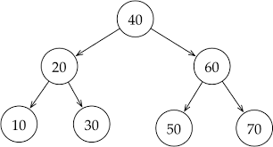
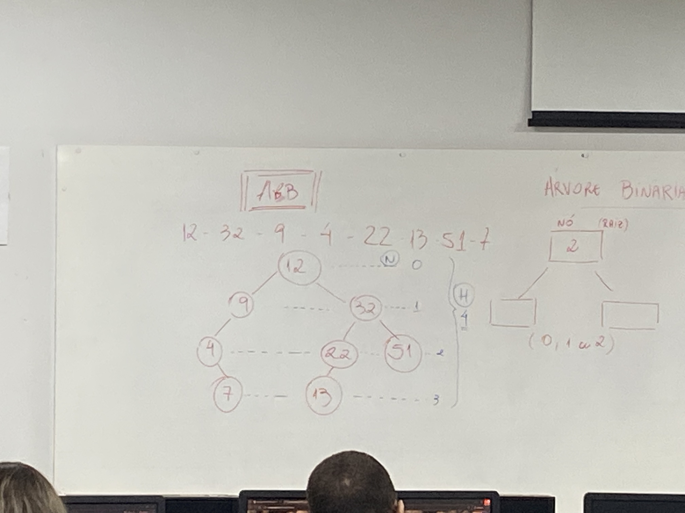
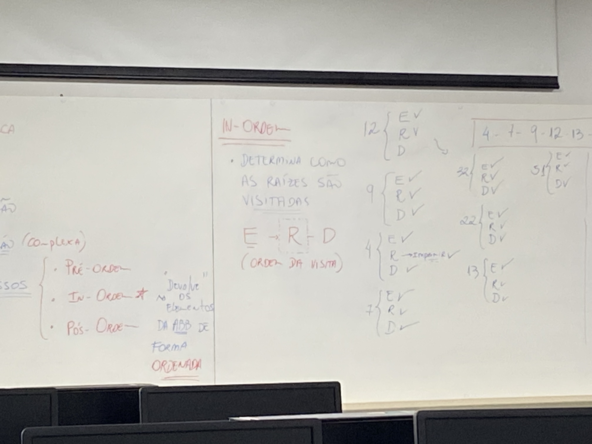

# Árvore Binária

## Árvore Binária de Busca (ABB)

É uma estrutura de dados de árvore binária onde a organização dos nós segue um padrão: para cada nó, todos os valores na subárvore esquerda são menores e todos os valores na subárvore direita são maiores.

### Busca: 

Ao procurar um valor, compara-se com o nó atual. Se o valor for menor, segue-se para a subárvore esquerda; se for maior, para a subárvore direita. 

### Inserção: 
O novo elemento é inserido em uma posição folha, seguindo a regra de comparação: vai para a esquerda se for menor que o nó pai e para a direita se for maior. 

**Conteúdo no Youtube:** https://www.youtube.com/watch?v=V3T67I9zuNw e https://www.youtube.com/watch?v=9UXmJKg1mQw

---

### Exemplo de Árvore utilizado para explicação dos percurssos e remoção:

### Percurssos: 

Os percursos de uma árvore binária de busca (ABB) são pré-ordem, in-ordem e pós-ordem.

            In-Ordem:               Esquerda -> Raiz -> Direita
                                         (Ordem da visita)

- Ordem final do **In-Ordem:** 4 - 7 - 9 - 12 - 13 - 22 - 32 - 51

            Pré-Ordem:              Raiz -> Esquerda -> Direita
                                        (Ordem da visita)

- Ordem final do **Pré-Ordem:** 12 - 9 - 4 - 7 - 32 - 22 - 13 - 51

            Pós-Ordem:              Esquerda -> Direita -> Raiz
                                        (Ordem da visita)

- Ordem final do **Pós-Ordem:** 7 - 4 - 9 - 13 - 22 - 51 - 32 - 12

---

### Remoção: 
Há três situações na remoção de elementos. Porém, primeiramente temos que buscar o elemento que desejamos remover.

- Quando o nó não possui filhos (nó folha):
    - Basta apenas removê-lo

- Quando o nó possui apenas 1 filho:
    
    - Tem que remover o elemento, gravar/atualizar seu sucessor em seu lugar e, por fim, remover o sucessor do seu antigo nó.

- Quando o nó possui 2 filhos:

    - Tem que remover o elemento, gravar/atualizar o MAIOR elemento da direita OU o MENOR elemento da esquerda e, por fim, remover o elemento gravado do seu antigo nó.