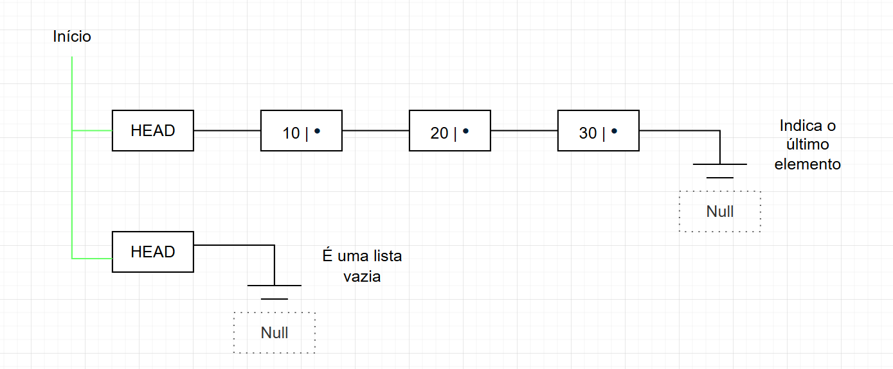

# Lista Dinâmica

## Encadeada
Conjuno de **itens**, todos do mesmo tipo, que estão na memória do PC.


OBS: É uma estrutura de dados genérica, e, permite a inserção e remoção de um elemento em qualquer lugar da lista.

**Esses itens são:**

- **Célula/Nó**: composto por um valor e um ponteiro que faz referêcia ao próximo valor/elemento da lista;

    Exemplo de representação dessa estrutura:

   ```
    struct No {
        int valor;
        No *prox;
    } 

    // O ponteiro é a própria estrutura
   ```
   

---   

**Operações:**

- Inserção (posição);
- Remoção (posição);
- Buscar elemento;
- Visualizar.


**Idéia do "Dinamicamente":**

- Capacidade de **alocar** uma região de memória sob demanda.

- **Malloc:** "reservar" uma posição na memória.

- **Sizeof:** "devolve" o tamanho da estrutura que desejamos **alocar**.

    Exemplo do Mallo e Sizeof:

    ```
    No*p = (No*)malloc(sizeof(No))

    // Malloc devolve uma região do tipo Nó
    // (No*) é um Cast
   ```