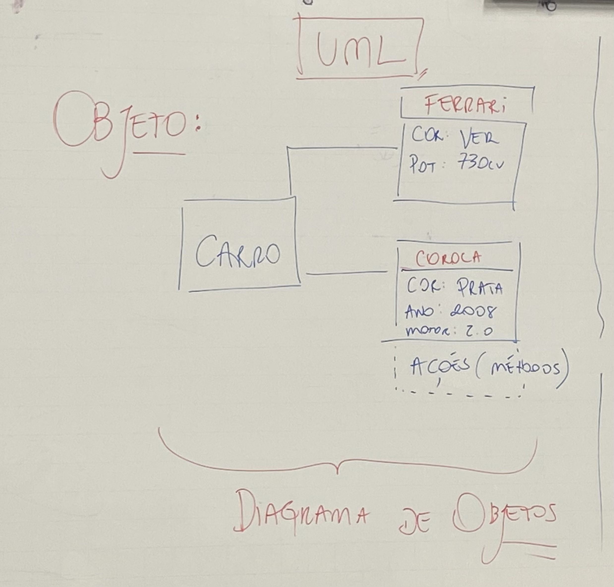
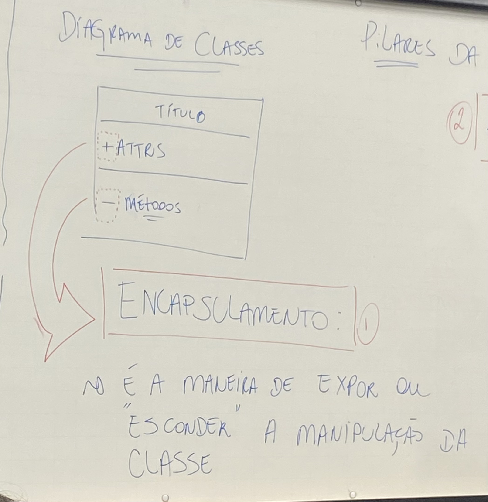
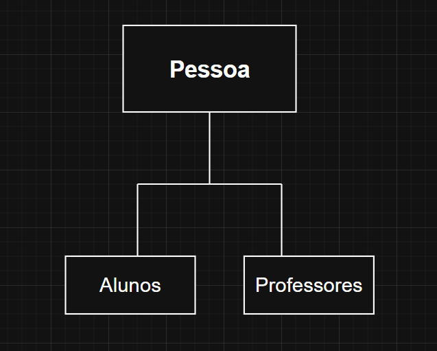

# Análise e Projetos Orientados a Objetos - 02/03

## Revisão da aula passada

### Objeto

> Um objeto é a instância de uma classe, representando uma entidade com atributos e métodos definidos pelo seu modelo.

### Diagrama de Classes

- **Encapsulamento:** é a maneira de expor ou "esconder" a manipulação da classe.

### Pilares da Orientação a Objetos

- **2) Abstração:** Capacidade de "pegar" apenas o essencial e expor através de uma simplificação

- **3) Herança:** Reutilização de código ; Classes especializadas, como por exemplo:

>Classe: Pessoa
>>Classes Especializadas: Alunos ; Professores 

- **4) Polimorfismo:** Diferentes objetos respodem de diferentes formas dado um mesmo método.