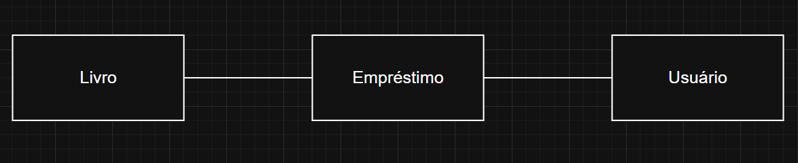
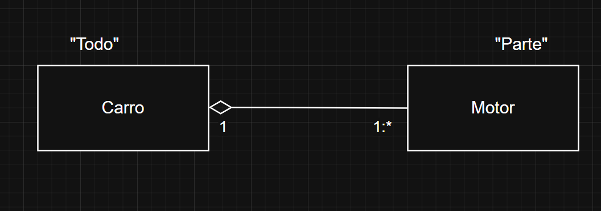

# Análise e Projetos Orientados a Objetos - 30/03/2026

## Relacionamentos de Objetos

### **Associação "Simples":**

> Código: A classe **Empréstimo** possui referência das classes **Usuário** e **Livro** (a referência é "passada" via parâmetro/injeção de independência).

### **Agregação:**

- Quando uma classe "Todo" **tem uma** outra classe "Parte";

- O ciclo de vida do objeto "Parte" independe do objeto "Todo".

### **Composição:**

- Quando uma classe "Todo" precisa ter uma "Parte";

- A Parte "é um todo";

- O ciclo de vida da "Parte" depende do ciclo de vida do "Todo".