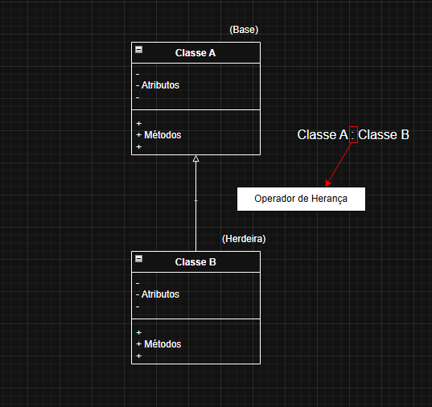

# Análise e Projetos Orientados a Objetos - 16/04/2026

## Herança

É uma forma de relacionamento entre duas classes, na qual, uma é a classe base e a outra é a classe herdeira (filha).

- Relacionamento de especialização/generalização. **(Relação "É-um")**

